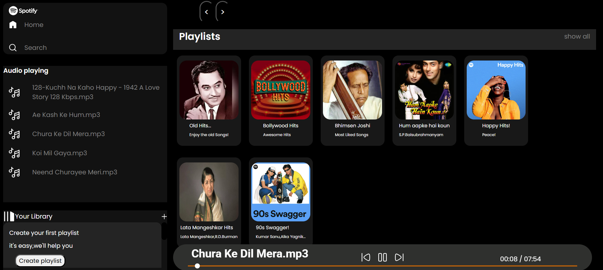

# 🎵 SpotifyClone

A music streaming web app where users can play songs stored in the repository. Built with **HTML, CSS, JavaScript**.



---

## 🚀 Features

✅ Play & Pause Songs 🎶  
✅ Fetches songs directly from GitHub Raw URLs 🔗  
✅ Modern UI with a dynamic playlist 📜  
✅ Mobile-friendly & responsive design 📱  
✅ Animated background colors 🎨

---

---

## 🛠 Setup & Installation

###  Clone Repository
```sh
git clone https://github.com/ChaitanyaKulkarni001/SpotifyClone.git
cd SpotifyClone
```


## 📡 Hosting Songs on GitHub (Raw URLs)
Since GitHub Pages doesn’t serve folders, songs are fetched via **GitHub Raw URLs**:

```js
currentSong.src = `https://raw.githubusercontent.com/ChaitanyaKulkarni001/SpotifyClone/master/Songs/${currentFolder}/${songs[currentIndex]}`;
currentSong.play();
```

---


## 📜 License
This project is open-source under the **MIT License**.

---

## ✨ Contribute
Pull requests are welcome! If you find any bugs or improvements, feel free to contribute.

---

### 🌟 Star the Repository ⭐
If you like this project, don’t forget to star ⭐ the repo on GitHub!

---
